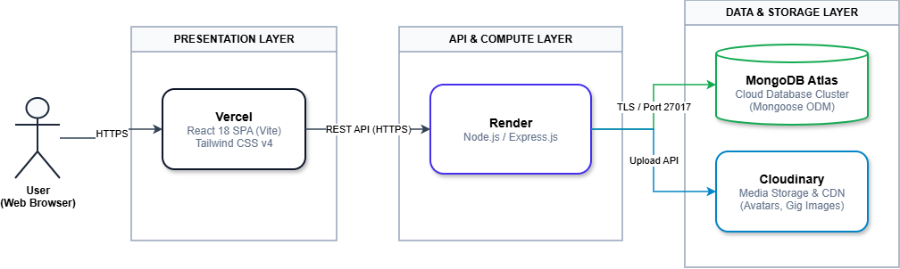

# Workly - Freelancer Marketplace Platform

Workly is a modern, full-stack freelancer marketplace web platform connecting clients (buyers), freelancers, and administrators. 

Users can discover professional services (Gigs) with multi-tier pricing, place and manage orders, collaborate through dedicated project workspaces, manage contracts and task boards, write verified reviews, receive real-time notifications, and administer the platform through a centralized Admin Dashboard.

## 🌐 Live Demo

* **Link web:** https://freelancer-platform-eight.vercel.app

---

## 🧭 Overview

Workly provides an end-to-end ecosystem for digital freelance work:

* **For Buyers (Clients):** Discover top talents and service gigs, purchase 3-tier packages (Basic, Standard, Premium), manage project deliverables, assign tasks to hired team members, track milestone contracts, and submit verified reviews upon order completion.
* **For Freelancers:** Showcase specialized skills and professional profiles, publish services (Gigs) with customizable delivery tiers, receive order requests, collaborate in project workspaces with task estimation, and build a trusted reputation through verified client ratings.
* **For Administrators:** Oversee platform integrity via a dedicated Admin Dashboard, review and approve/reject "Become a Freelancer" applications, manage marketplace categories and skill taxonomies, and inspect platform analytics.

---
## ✨ Features

### Authentication & Security
* User registration, login, and secure session management.
* JWT authentication with Access Token and Refresh Token rotation.
* Role-Based Access Control (RBAC) with strict role segregation (`buyer`, `freelancer`, `admin`).
* Password hashing using `bcrypt`.
* Input validation on every request via `Zod` schemas.
* CORS protection with configurable allowed origins.
* Dual-theme (Light/Dark mode) and bilingual localization (English / Vietnamese) with instant language toggle.

### Freelancer Marketplace & Gigs
* Search and filter Gigs by category, tags, price range, rating, and keyword search with Vietnamese diacritic normalization.
* Multi-tier Gig packages: Basic, Standard, and Premium (price, delivery days, revisions, feature details).
* Freelancer public profiles displaying level, rating, completed orders, verified skills, and client feedback.
* High-performance Gig banners and responsive thumbnail galleries powered by Cloudinary.

### Orders & Project Workspaces
* Complete order lifecycle: `pending` → `in_progress` → `delivered` → `completed` / `cancelled`.
* Automatic order snapshots preserving Gig and package details at the moment of purchase.
* Project workspace for multi-party collaboration between clients and hired freelancers.
* Team member management and role allocation within projects.

### Contracts & Kanban Task Board
* Fixed-price and hourly contracts with milestone tracking and payment status.
* Interactive task board with lifecycle states: `todo`, `in_progress`, `done`, `cancelled`.
* Task metadata tracking: assignee, effort points, estimated hours, actual hours, and due dates.

### Rating & Verified Reviews
* Strict Buyer → Freelancer review workflow available only after order completion.
* Single permanent review per completed order to ensure review authenticity and prevent tampering.
* Real-time calculation and aggregation of Gig and Freelancer ratings directly from database records.

### Become Freelancer Approval & Admin Dashboard
* Multi-step approval workflow: Buyer submits application → status becomes `pending` → Admin reviews → `approved` (promotes role to Freelancer) or `rejected` with feedback.
* Dedicated Admin Dashboard with strictly isolated layouts and administrative routes:
  * `/admin/overview` – Real-time marketplace statistics and overview metrics.
  * `/admin/applications` – Freelancer application review, approval, and rejection.
  * `/admin/categories` – Full CRUD management for service categories.
  * `/admin/skills` – Full CRUD management for skill taxonomies.
  * `/admin/analytics` – Marketplace metrics and growth charts.

### Notification System & Localization
* In-app notifications for cross-user events (application approved/rejected, review received, order updates).
* Unread counter badge, mark-as-read, and mark-all-as-read actions.
* Multi-language support (English & Vietnamese) powered by `i18next` with language-independent notification metadata.

### Cloud Media Storage (Cloudinary)
* 100% in-memory streaming uploads via Multer `memoryStorage` piped directly to Cloudinary.
* Zero uploaded files stored on the local backend server disk in production.
* Automatic lifecycle asset cleanup: old Cloudinary images are automatically deleted when avatars or Gig banners are replaced or deleted.

---

## 💻 Tech Stack

| Layer | Technology | Description |
| :--- | :--- | :--- |
| **Frontend Framework** | React 18, Vite | High-performance SPA with fast HMR |
| **Styling & UI** | Tailwind CSS v4 | Utility-first CSS with dark mode support |
| **Icons** | Lucide React | Modern, lightweight icon system |
| **State Management** | Zustand | Lightweight, persistent client state store |
| **Routing** | React Router v6 | Declarative routing with RBAC Protected Routes |
| **HTTP Client** | Axios | Configured with token interceptors & auto-refresh |
| **Internationalization** | i18next, react-i18next | Dynamic VI / EN language switching |
| **Backend Runtime** | Node.js, Express.js | RESTful API service architecture |
| **Database** | MongoDB Atlas | Cloud-hosted NoSQL document database |
| **ODM** | Mongoose 9.x | Schemas, compound indexes, lean queries |
| **Authentication** | JWT (`jsonwebtoken`), `bcrypt` | Token-based auth & salted password hashing |
| **Validation** | Zod | Strict schema validation on request payload |
| **File / Media Storage** | Cloudinary | Cloud image hosting & global CDN delivery |
| **File Upload** | Multer (`memoryStorage`) | In-memory buffer streaming without disk write |
| **API Documentation** | Swagger UI (`swagger-jsdoc`) | Interactive OpenAPI documentation (`/api-docs`) |
| **Frontend Deployment** | Vercel | Global Edge CDN hosting |
| **Backend Deployment** | Render | Managed cloud web service |
| **Database Deployment** | MongoDB Atlas | 3-node replica set cloud cluster |

---

## 🏗️ System Architecture



---

## 📦 Project Structure

```text
workly/
├── backend/
│   ├── src/
│   │   ├── config/
│   │   │   ├── cloudinary.js           # Cloudinary v2 SDK configuration
│   │   │   ├── database.js             # MongoDB Atlas connection setup
│   │   │   └── swagger.js              # Swagger/OpenAPI specification
│   │   ├── constants/                  # Enums (order, project, contract, task status)
│   │   ├── controllers/                # Request handling & HTTP response mapping
│   │   │   ├── admin.controller.js
│   │   │   ├── auth.controller.js
│   │   │   ├── gig.controller.js
│   │   │   ├── order.controller.js
│   │   │   ├── project.controller.js
│   │   │   ├── user.controller.js
│   │   │   └── ...
│   │   ├── middlewares/                # Auth, RBAC, Multer memoryStorage, Zod validation
│   │   ├── models/                     # Mongoose schemas (User, Gig, Order, Task, Review...)
│   │   ├── routes/                     # REST API route endpoints
│   │   ├── schemas/                    # Zod validation schemas
│   │   ├── services/                   # Core business logic & database operations
│   │   │   ├── cloudinary.service.js   # Buffer streaming & asset lifecycle deletion
│   │   │   ├── gig.service.js
│   │   │   ├── order.service.js
│   │   │   └── ...
│   │   ├── utils/                      # DTO formatters, error classes, diacritics regex
│   │   ├── app.js                      # Express app, middleware pipeline, global error handler
│   │   └── server.js                   # Server bootstrap & port listener
│   ├── .env.example
│   ├── package.json
│   └── README.md
│
├── frontend/
│   ├── public/                         # Favicon icons & public static assets
│   ├── src/
│   │   ├── assets/                     # Workly branding logo & graphics
│   │   ├── components/
│   │   │   ├── admin/                  # Admin layout, sidebar, stat cards
│   │   │   ├── common/                 # Brand, GigCard, OrderThumbnail, Pagination
│   │   │   ├── gigs/                   # GigFormModal, package pricing tables
│   │   │   ├── landing/                # Hero, CategorySection, FeaturedGigs, CTA
│   │   │   ├── reviews/                # ReviewModal, ReviewList
│   │   │   └── ui/                     # Avatar, Badge, Button, Dialog, Input, Toast
│   │   ├── hooks/                      # Custom hooks (useTheme, useDebounce...)
│   │   ├── i18n/                       # English & Vietnamese translation JSON files
│   │   ├── layouts/                    # MainLayout, AdminLayout, AuthLayout
│   │   ├── pages/                      # Application route pages
│   │   │   ├── admin/                  # AdminOverview, Applications, Categories, Skills
│   │   │   ├── GigDetailPage.jsx
│   │   │   ├── GigsPage.jsx
│   │   │   ├── OrderDetailPage.jsx
│   │   │   ├── ProjectWorkspacePage.jsx
│   │   │   ├── ProfilePage.jsx
│   │   │   └── ...
│   │   ├── routes/                     # App router with ProtectedRoute guards
│   │   ├── services/                   # Axios API service callers
│   │   ├── stores/                     # Zustand state stores (authStore...)
│   │   ├── utils/                      # Media resolver, error handler
│   │   ├── App.jsx
│   │   ├── index.css                   # Tailwind CSS v4 theme variables
│   │   └── main.jsx
│   ├── index.html
│   ├── package.json
│   ├── vite.config.js
│   └── README.md
│
├── docs/
│   └── system-architecture.svg         # Architecture vector diagram
├── .gitignore
└── README.md
```
---

## 🌐 Deployment

### Frontend (Vercel)
The React + Vite SPA is deployed on **Vercel** with automatic preview deployments and edge routing:
* Build Command: `npm run build`
* Output Directory: `dist`
* Environment Variables: `VITE_API_BASE_URL` pointing to the Render backend URL.

### Backend (Render)
The Express.js REST API is deployed as a Web Service on **Render**:
* Build Command: `npm install`
* Start Command: `npm start` (or `node ./src/server.js`)
* Environment Variables configured in the Render Dashboard (JWT secrets, MongoDB URI, Cloudinary credentials).

### Database (MongoDB Atlas)
A high-availability managed **MongoDB Atlas** cluster:
* 3-node replica set with automated backups and network IP whitelisting.
* Secure TLS encrypted wire protocol connection (`mongodb+srv://...`).

### Media Storage (Cloudinary)
All profile avatars and service gig images are streamed to **Cloudinary**:
* Zero local file storage on server disk.
* Automated lifecycle deletion on replacement or entity removal.
* Served worldwide via Cloudinary's multi-region CDN.

---

